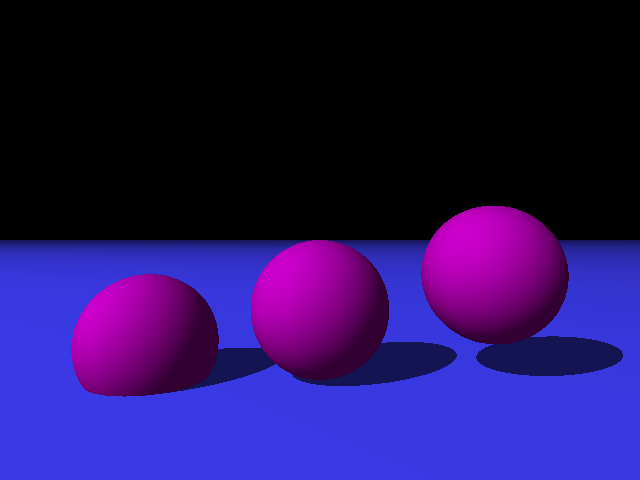
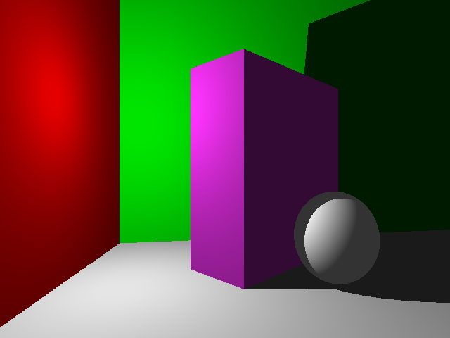
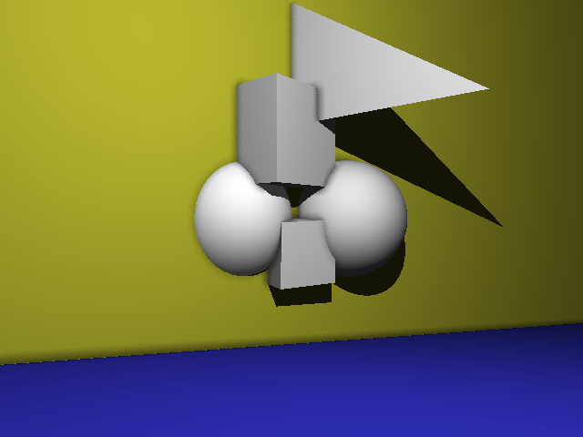
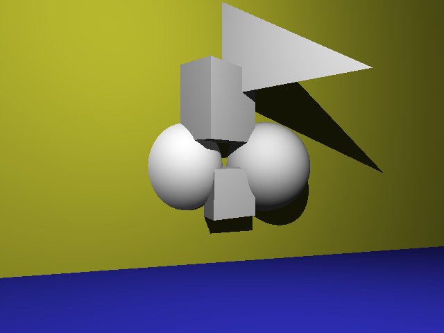

# ray-tracer

## Final Project Info

### Final Feature
For my final feature I chose to implement ambient occlusion. I wanted to add some feature that added more realism to shading; in particular, I felt that intersecting objects were lacking in the realism department. There wasn't any indication of a transition between the two objects. AO helped to fix that issue by darkening the area where the objects intersect.

To implement this, I refactored my shadow calculation code to allow for objects to be in partial shadow. This is represented by a "shadow factor" variable, which is a float between 0 and 1. 0 is entirely in shadow, while 1 is entirely in light. When testing the color of a point, I send feeler rays from that point to see how occluded it is. If a ray doesn't intersect any object OR if it intersects an object that is far away from the point, then I add 1/(total amount of feeler rays) to the shadow factor variable. Over the course of many feeler rays, the shadow factor begins to reflect how dark the point should be. For example, if the point is close to the intersection of two objects, then many feeler rays would have intersections close to their origins, making the shadow factor variable closer to 0. This shadow factor is then multiplied by the diffuse and specular components. Thus, an occluded point will have a smaller shadow factor, and therefore have reduced diffuse and specular shading. This results in darkened areas close to the intersections of objects to reflect the fact that these areas are occluded and don't receive as much light.

With Ambient Occlusion | Without Ambient Occlusion
---------------------- | -------------------------
 | 
 | 
 | 

### Resources
I only used the provided notes on ambient occlusion, as well as previous knowledge about the method of implementing Monte Carlo global illumination.

### Software Design Implementation
Initially, my FileParser.cpp file was incredibly long and redundant. Parsing a variable had a few key steps, and these steps had to be rewritten for every parsed variable for every parsed object. This led to lengthy, repetitive methods that were difficult to read.

To fix this issue, I realized that variables inside pov files could only be one of three types: a single float, a vec3, or a vec4. Knowing this, I was able to simplify my code by creating three generic methods that each specialized in parsing one of these types. This greatly reduced the length of FileParser.cpp, and increased legibility as well. Separating functionality into several methods also made it easier to debug issues with my parser program.

To demonstrate how significant this refactoring was, I've included my code for parsing a sphere prior to refactoring and from my current version.

#### Prior to Refactoring
```javascript
void FileParser::parseSphere(ifstream &file)
{
    vec3 center = vec3(0, 0, 0);
    vec3 color = vec3(0, 0, 0);
    float radius = 0, ambient = 0, diffuse = 0, specular = 0, roughness = 0.3;
    float metallic = 0.1, ior = 1.6;
    size_t found = 0, end = 0;
    string segment = "", temp;
    
    // Since there are subsections denoted with curly braces, we have to search
    // for the '}' without a corresponding '{'. This means that it is the end
    // of the sphere information.
    getline(file, temp, '}');
    while (count(temp.begin(), temp.end(), '{') > 0) {
        temp.append("}");
        segment.append(temp);
        getline(file, temp, '}');
    }
    segment.append(temp);
    
    // Remove all whitespace from the string.
    segment.erase(remove(segment.begin(), segment.end(), ' '), segment.end());
    // Remove all newlines from the string.
    segment.erase(remove(segment.begin(), segment.end(), '\n'), segment.end());
    
    found = segment.find("<");
    if (found != string::npos) {
        // Go to beginning of x value for center.
        found += sizeof("<") - 1;
        end = segment.find(",", found);
        temp = segment.substr(found, end - found);
        center.x = atof(temp.c_str());
        
        // Go to beginning of y value for center.
        found = end + 1;
        end = segment.find(",", found);
        temp = segment.substr(found, end - found);
        center.y = atof(temp.c_str());
        
        // Go to beginning of y value for center.
        found = end + 1;
        end = segment.find(">", found);
        temp = segment.substr(found, end - found);
        center.z = atof(temp.c_str());
    }
    
    found = segment.find(",", end);
    if (found != string::npos) {
        // Go to beginning of radius.
        found += sizeof(",") - 1;
        end = segment.find_first_not_of("0123456789.", found);
        temp = segment.substr(found, end - found);
        radius = atof(temp.c_str());
    }
    
    found = segment.find("colorrgb");
    if (found != string::npos) {
        // Go to beginning of r value for color.
        found += sizeof("colorrgb");
        end = segment.find(",", found);
        temp = segment.substr(found, end - found);
        color.x = atof(temp.c_str());
        
        // Go to beginning of g value for color.
        found = end + 1;
        end = segment.find(",", found);
        temp = segment.substr(found, end - found);
        color.y = atof(temp.c_str());
        
        // Go to beginning of b value for color.
        found = end + 1;
        end = segment.find(">", found);
        temp = segment.substr(found, end - found);
        color.z = atof(temp.c_str());
    }
    
    found = segment.find("ambient");
    if (found != string::npos) {
        // Go to beginning of ambient factor.
        found += sizeof("ambient") - 1;
        end = segment.find_first_not_of("0123456789.", found);
        temp = segment.substr(found, end-found);
        ambient = atof(temp.c_str());
    }
    
    found = segment.find("diffuse");
    if (found != string::npos) {
        // Go to beginning of diffuse factor.
        found += sizeof("diffuse") - 1;
        end = segment.find_first_not_of("0123456789.", found);
        temp = segment.substr(found, end - found);
        diffuse = atof(temp.c_str());
    }
    
    found = segment.find("specular");
    if (found != string::npos) {
        // Go to beginning of specular factor.
        found += sizeof("specular") - 1;
        end = segment.find_first_not_of("0123456789.", found);
        temp = segment.substr(found, end - found);
        specular = atof(temp.c_str());
    }
    
    found = segment.find("roughness");
    if (found != string::npos) {
        // Go to beginning of roughness factor.
        found += sizeof("roughness") - 1;
        end = segment.find_first_not_of("0123456789.", found);
        temp = segment.substr(found, end - found);
        roughness = atof(temp.c_str());
    }
    
    found = segment.find("metallic");
    if (found != string::npos) {
        // Go to beginning of metallic factor.
        found += sizeof("metallic") - 1;
        end = segment.find_first_not_of("0123456789.", found);
        temp = segment.substr(found, end - found);
        metallic = atof(temp.c_str());
    }
    
    found = segment.find("ior");
    if (found != string::npos) {
        // Go to beginning of ior factor.
        found += sizeof("ior") - 1;
        end = segment.find_first_not_of("0123456789.", found);
        temp = segment.substr(found, end - found);
        ior = atof(temp.c_str());
    }
    
    shared_ptr<Sphere> sphere = make_shared<Sphere>(center, radius, color,
                                                    ambient, diffuse, specular,
                                                    roughness, metallic, ior);
    objects.push_back(sphere);
}
```
#### Current Version
```javascript
void FileParser::parseSphere(ifstream &file, const int ID)
{
    vec3 center = vec3(0);
    vec3 color = vec3(0);
    vec4 rgbf = vec4(0);
    float radius = 0, ambient = 0, diffuse = 0, specular = 0, reflection = 0;
    float roughness = 0.3, metallic = 0.1, ior = 1.6;
    mat4 inverseModelMatrix = mat4(1.0);
    size_t newStart = 0;
    bool hasFilter = false;
    
    string segment = getNextSegment(file);
    
    removeNewlinesAndWhitespace(segment);
    
    newStart = findAndSetVec3Parameter(segment, center, "<", 0);
    findAndSetSingleValueParameter(segment, radius, ",", newStart);
    hasFilter = findAndSetVec4Parameter(segment, rgbf, "colorrgbf<", 0);
    if (!hasFilter) {
        findAndSetVec3Parameter(segment, color, "colorrgb<", 0);
    }
    findAndSetSingleValueParameter(segment, ambient, "ambient", 0);
    findAndSetSingleValueParameter(segment, diffuse, "diffuse", 0);
    findAndSetSingleValueParameter(segment, specular, "specular", 0);
    findAndSetSingleValueParameter(segment, reflection, "reflection", 0);
    findAndSetSingleValueParameter(segment, roughness, "roughness", 0);
    findAndSetSingleValueParameter(segment, metallic, "metallic", 0);
    findAndSetSingleValueParameter(segment, ior, "ior", 0);
    inverseModelMatrix = calculateInverseModelMatrix(segment);
    
    shared_ptr<Sphere> sphere;
    if (hasFilter) {
        sphere = make_shared<Sphere>(ID, center, radius, vec3(rgbf), ambient, diffuse,
                                     specular, reflection, rgbf.w, roughness, metallic,
                                     ior, inverseModelMatrix);
    }
    else {
        sphere = make_shared<Sphere>(ID, center, radius, color, ambient, diffuse, specular,
                                     reflection, 0, roughness, metallic, ior, inverseModelMatrix);
    }
    
    if (BVH) {
        nonPlanes.push_back(sphere);
    }
    else {
        objects.push_back(sphere);
    }
}
```


## General Info

### Parsing
Parses Camera, Lights, Spheres, Boxes, Planes, and Triangles correctly. Comments are ignored. Object transforms manipulate the object properly, provided all transforms are given consecutively.

### Rendering
Images can render with either Blinn-Phong and Cook-Torrance. Reflectance and Refraction are functioning properly. Schlick's Approximation, Beer's Law, anti-aliasing, global illumination, and ambient occlusion are implemented.

### Spatial Data Structure
Bounding Volume Hierarchy is implemented.
